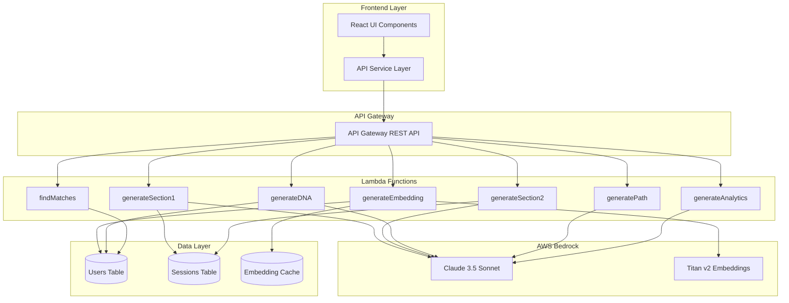
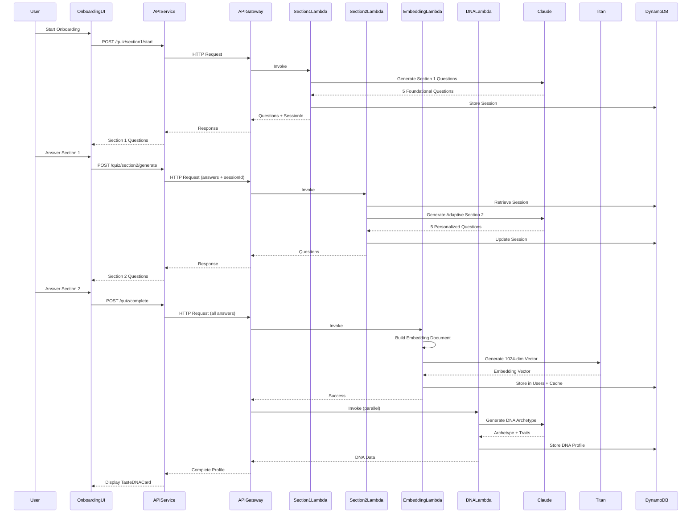

# Design Document: VibeGraph Backend Integration

## Overview

This design integrates the VibeGraph serverless backend architecture with the existing React frontend, creating a complete adaptive quiz system with AI-powered taste profiling. The integration establishes a clean API service layer that connects the frontend onboarding UI to Lambda functions for adaptive quiz generation, Titan v2 embedding creation, DNA archetype generation, growth path recommendations, taste matching, and behavioral analytics.

The architecture maintains strict separation of concerns: all AI processing happens server-side via AWS Bedrock (Claude + Titan v2), the frontend remains lightweight with no AWS SDK dependencies, and user privacy is preserved by storing only embeddings rather than raw quiz responses. The system leverages DynamoDB for user data and embedding cache, API Gateway for HTTP endpoints, and implements cost-efficient caching strategies to minimize LLM calls.

## Architecture

### System Overview




### Onboarding Flow Sequence




## Components and Interfaces

### Frontend: API Service Layer

**Purpose**: Centralized service for all backend API calls, abstracting Lambda endpoints from UI components

**Interface**:
```typescript
interface QuizAPI {
  startSection1(): Promise<Section1Response>
  generateSection2(sessionId: string, section1Answers: Answer[]): Promise<Section2Response>
  completeQuiz(sessionId: string, allAnswers: QuizAnswers): Promise<CompleteQuizResponse>
}

interface ProfileAPI {
  getTasteDNA(userId: string): Promise<TasteDNAProfile>
  getGrowthPath(userId: string): Promise<GrowthPath>
  getMatches(userId: string, limit?: number): Promise<Match[]>
  getAnalytics(userId: string): Promise<AnalyticsData>
}

interface VibeGraphAPI {
  quiz: QuizAPI
  profile: ProfileAPI
}
```

**Responsibilities**:
- HTTP request/response handling with API Gateway
- Error handling and retry logic
- Request/response transformation
- Authentication token management
- Loading state management

**Implementation Location**: `frontend/src/services/vibeGraphAPI.js`


### Frontend: Enhanced OnboardingPage Component

**Purpose**: Orchestrate adaptive quiz flow with backend integration

**Interface**:
```typescript
interface OnboardingPageProps {
  onComplete: (profile: TasteDNAProfile) => void
}

interface OnboardingState {
  phase: 'section1' | 'section2' | 'processing' | 'complete'
  sessionId: string | null
  section1Questions: Question[]
  section2Questions: Question[]
  section1Answers: Answer[]
  section2Answers: Answer[]
  tasteDNA: TasteDNAProfile | null
  loading: boolean
  error: Error | null
}
```

**Responsibilities**:
- Manage multi-phase quiz flow (Section 1 → Section 2 → Processing → DNA Display)
- Call API service for question generation and completion
- Handle loading and error states
- Preserve session state across phases
- Display TasteDNACard on completion

**Key Changes from Current Implementation**:
- Replace static `onboardingQuestions` with dynamic API calls
- Add session management with `sessionId`
- Implement adaptive Section 2 generation based on Section 1 answers
- Add loading states during AI generation
- Handle backend errors gracefully


### Backend: generateSection1 Lambda

**Purpose**: Generate foundational quiz questions (Section 1) using Claude

**Interface**:
```typescript
interface Section1Request {
  userId?: string
}

interface Section1Response {
  sessionId: string
  questions: Question[]
  expiresAt: number
}

interface Question {
  id: string
  title: string
  category: string
  options: string[]
  multiSelect: boolean
}
```

**Algorithm**:
```pascal
PROCEDURE generateSection1(userId)
  INPUT: userId (optional)
  OUTPUT: Section1Response
  
  SEQUENCE
    sessionId ← generateUUID()
    timestamp ← getCurrentTimestamp()
    
    // Load adaptive quiz prompt
    prompt ← loadPrompt("adaptiveQuizPrompt.txt")
    
    // Call Claude to generate Section 1
    claudeRequest ← {
      model: "anthropic.claude-3-5-sonnet-20241022-v2:0",
      messages: [{ role: "user", content: prompt }],
      temperature: 0.7,
      max_tokens: 2000
    }
    
    claudeResponse ← claudeService.invoke(claudeRequest)
    questions ← parseQuestionsFromResponse(claudeResponse)
    
    // Store session in DynamoDB
    session ← {
      sessionId: sessionId,
      userId: userId,
      section1Questions: questions,
      createdAt: timestamp,
      expiresAt: timestamp + 3600,
      status: "section1_complete"
    }
    
    dynamoDB.putItem("sessions", session)
    
    RETURN {
      sessionId: sessionId,
      questions: questions,
      expiresAt: session.expiresAt
    }
  END SEQUENCE
END PROCEDURE
```

**Preconditions**:
- Claude Bedrock model is accessible
- DynamoDB sessions table exists
- Adaptive quiz prompt is loaded

**Postconditions**:
- Session created in DynamoDB with 1-hour TTL
- 5 foundational questions returned
- sessionId is valid UUID


### Backend: generateSection2 Lambda

**Purpose**: Generate adaptive Section 2 questions based on Section 1 answers

**Interface**:
```typescript
interface Section2Request {
  sessionId: string
  section1Answers: Answer[]
}

interface Section2Response {
  questions: Question[]
}

interface Answer {
  questionId: string
  selectedOptions: string[]
}
```

**Algorithm**:
```pascal
PROCEDURE generateSection2(sessionId, section1Answers)
  INPUT: sessionId, section1Answers
  OUTPUT: Section2Response
  
  SEQUENCE
    // Retrieve session from DynamoDB
    session ← dynamoDB.getItem("sessions", sessionId)
    
    IF session IS NULL OR session.expiresAt < getCurrentTimestamp() THEN
      THROW Error("Session expired or not found")
    END IF
    
    // Build context from Section 1 answers
    context ← buildAnswerContext(session.section1Questions, section1Answers)
    
    // Load adaptive quiz prompt with context
    prompt ← loadPrompt("adaptiveQuizPrompt.txt")
    adaptivePrompt ← injectContext(prompt, context)
    
    // Call Claude to generate adaptive Section 2
    claudeRequest ← {
      model: "anthropic.claude-3-5-sonnet-20241022-v2:0",
      messages: [{ role: "user", content: adaptivePrompt }],
      temperature: 0.7,
      max_tokens: 2000
    }
    
    claudeResponse ← claudeService.invoke(claudeRequest)
    questions ← parseQuestionsFromResponse(claudeResponse)
    
    // Update session with Section 2 data
    session.section1Answers ← section1Answers
    session.section2Questions ← questions
    session.status ← "section2_complete"
    
    dynamoDB.updateItem("sessions", sessionId, session)
    
    RETURN { questions: questions }
  END SEQUENCE
END PROCEDURE
```

**Preconditions**:
- Valid sessionId exists in DynamoDB
- Session has not expired (< 1 hour old)
- section1Answers contains valid responses

**Postconditions**:
- Session updated with Section 1 answers and Section 2 questions
- 5 adaptive questions returned based on Section 1 responses
- Session status updated to "section2_complete"


### Backend: generateEmbedding Lambda

**Purpose**: Build embedding document from quiz answers and generate 1024-dim vector via Titan v2

**Interface**:
```typescript
interface EmbeddingRequest {
  sessionId: string
  userId: string
  allAnswers: QuizAnswers
}

interface EmbeddingResponse {
  embeddingId: string
  vector: number[]
  dimension: number
}

interface QuizAnswers {
  section1: Answer[]
  section2: Answer[]
}
```

**Algorithm**:
```pascal
PROCEDURE generateEmbedding(sessionId, userId, allAnswers)
  INPUT: sessionId, userId, allAnswers
  OUTPUT: EmbeddingResponse
  
  SEQUENCE
    // Build structured embedding document
    embeddingDoc ← embeddingBuilder.build(allAnswers)
    
    // Check cache for existing embedding
    docHash ← hash(embeddingDoc)
    cachedEmbedding ← cacheService.get(docHash)
    
    IF cachedEmbedding IS NOT NULL THEN
      vector ← cachedEmbedding.vector
    ELSE
      // Generate embedding via Titan v2
      titanRequest ← {
        model: "amazon.titan-embed-text-v2:0",
        inputText: embeddingDoc,
        dimensions: 1024,
        normalize: true
      }
      
      titanResponse ← titanService.invoke(titanRequest)
      vector ← titanResponse.embedding
      
      // Cache the embedding
      cacheService.put(docHash, vector)
    END IF
    
    // Apply weighting engine
    weightedVector ← weightingEngine.apply(vector, allAnswers)
    
    // Normalize vector
    normalizedVector ← normalizeVector(weightedVector)
    
    // Store in Users table
    embeddingId ← generateUUID()
    userRecord ← {
      userId: userId,
      embeddingId: embeddingId,
      vector: normalizedVector,
      dimension: 1024,
      createdAt: getCurrentTimestamp(),
      quizVersion: "v1"
    }
    
    dynamoDB.putItem("users", userRecord)
    
    RETURN {
      embeddingId: embeddingId,
      vector: normalizedVector,
      dimension: 1024
    }
  END SEQUENCE
END PROCEDURE
```

**Preconditions**:
- Valid sessionId and userId
- allAnswers contains both Section 1 and Section 2 responses
- Titan v2 model is accessible

**Postconditions**:
- 1024-dimensional embedding vector generated
- Vector normalized to unit length
- Embedding stored in Users table
- Cache updated if new embedding generated
- Raw quiz answers NOT stored (privacy-first)

**Loop Invariants**: N/A


### Backend: generateDNA Lambda

**Purpose**: Generate taste DNA archetype and traits using Claude based on quiz answers

**Interface**:
```typescript
interface DNARequest {
  userId: string
  allAnswers: QuizAnswers
}

interface DNAResponse {
  archetype: string
  traits: Trait[]
  categories: CategoryProfile[]
  description: string
}

interface Trait {
  name: string
  score: number
  description: string
}

interface CategoryProfile {
  category: string
  preferences: string[]
  intensity: number
}
```

**Algorithm**:
```pascal
PROCEDURE generateDNA(userId, allAnswers)
  INPUT: userId, allAnswers
  OUTPUT: DNAResponse
  
  SEQUENCE
    // Build context from answers
    answerSummary ← summarizeAnswers(allAnswers)
    
    // Load DNA generation prompt
    prompt ← loadPrompt("dnaPrompt.txt")
    dnaPrompt ← injectAnswers(prompt, answerSummary)
    
    // Call Claude to generate DNA profile
    claudeRequest ← {
      model: "anthropic.claude-3-5-sonnet-20241022-v2:0",
      messages: [{ role: "user", content: dnaPrompt }],
      temperature: 0.8,
      max_tokens: 1500
    }
    
    claudeResponse ← claudeService.invoke(claudeRequest)
    dnaProfile ← parseDNAFromResponse(claudeResponse)
    
    // Store DNA profile in Users table
    userUpdate ← {
      userId: userId,
      tasteDNA: dnaProfile,
      updatedAt: getCurrentTimestamp()
    }
    
    dynamoDB.updateItem("users", userId, userUpdate)
    
    RETURN dnaProfile
  END SEQUENCE
END PROCEDURE
```

**Preconditions**:
- Valid userId exists
- allAnswers contains complete quiz responses
- DNA prompt template is loaded

**Postconditions**:
- DNA archetype generated (e.g., "The Minimalist", "The Explorer")
- Trait scores calculated (0-10 scale)
- Category profiles created for each content type
- DNA profile stored in Users table


### Backend: generatePath Lambda

**Purpose**: Generate personalized growth path with Absorb/Create/Reflect structure

**Interface**:
```typescript
interface PathRequest {
  userId: string
}

interface PathResponse {
  path: GrowthPath
}

interface GrowthPath {
  absorb: PathItem[]
  create: PathItem[]
  reflect: PathItem[]
  generatedAt: number
}

interface PathItem {
  id: string
  title: string
  description: string
  category: string
  estimatedTime: string
  difficulty: 'beginner' | 'intermediate' | 'advanced'
}
```

**Algorithm**:
```pascal
PROCEDURE generatePath(userId)
  INPUT: userId
  OUTPUT: PathResponse
  
  SEQUENCE
    // Retrieve user profile
    user ← dynamoDB.getItem("users", userId)
    
    IF user IS NULL THEN
      THROW Error("User not found")
    END IF
    
    // Build context from DNA and embedding
    context ← {
      archetype: user.tasteDNA.archetype,
      traits: user.tasteDNA.traits,
      categories: user.tasteDNA.categories
    }
    
    // Load path generation prompt
    prompt ← loadPrompt("pathPrompt.txt")
    pathPrompt ← injectContext(prompt, context)
    
    // Call Claude to generate growth path
    claudeRequest ← {
      model: "anthropic.claude-3-5-sonnet-20241022-v2:0",
      messages: [{ role: "user", content: pathPrompt }],
      temperature: 0.7,
      max_tokens: 2500
    }
    
    claudeResponse ← claudeService.invoke(claudeRequest)
    growthPath ← parsePathFromResponse(claudeResponse)
    
    // Store path in Users table
    userUpdate ← {
      userId: userId,
      growthPath: growthPath,
      pathGeneratedAt: getCurrentTimestamp()
    }
    
    dynamoDB.updateItem("users", userId, userUpdate)
    
    RETURN { path: growthPath }
  END SEQUENCE
END PROCEDURE
```

**Preconditions**:
- Valid userId with existing DNA profile
- Path prompt template is loaded

**Postconditions**:
- Growth path generated with 3 categories (Absorb, Create, Reflect)
- Each category contains 3-5 personalized recommendations
- Path stored in Users table with timestamp


### Backend: findMatches Lambda

**Purpose**: Find taste matches using cosine similarity on embedding vectors

**Interface**:
```typescript
interface MatchRequest {
  userId: string
  limit?: number
}

interface MatchResponse {
  matches: Match[]
}

interface Match {
  userId: string
  username: string
  similarity: number
  sharedTraits: string[]
  archetype: string
}
```

**Algorithm**:
```pascal
PROCEDURE findMatches(userId, limit)
  INPUT: userId, limit (default: 10)
  OUTPUT: MatchResponse
  
  SEQUENCE
    // Retrieve user's embedding vector
    user ← dynamoDB.getItem("users", userId)
    
    IF user IS NULL OR user.vector IS NULL THEN
      THROW Error("User embedding not found")
    END IF
    
    userVector ← user.vector
    
    // Scan all users (optimize with vector index in production)
    allUsers ← dynamoDB.scan("users")
    matches ← []
    
    FOR each otherUser IN allUsers DO
      IF otherUser.userId = userId THEN
        CONTINUE
      END IF
      
      IF otherUser.vector IS NULL THEN
        CONTINUE
      END IF
      
      // Calculate cosine similarity
      similarity ← cosineSimilarity(userVector, otherUser.vector)
      
      IF similarity > 0.7 THEN
        // Find shared traits
        sharedTraits ← findSharedTraits(user.tasteDNA, otherUser.tasteDNA)
        
        match ← {
          userId: otherUser.userId,
          username: otherUser.username,
          similarity: similarity,
          sharedTraits: sharedTraits,
          archetype: otherUser.tasteDNA.archetype
        }
        
        matches.append(match)
      END IF
    END FOR
    
    // Sort by similarity descending
    matches ← sortByDescending(matches, "similarity")
    
    // Limit results
    matches ← matches.slice(0, limit)
    
    RETURN { matches: matches }
  END SEQUENCE
END PROCEDURE
```

**Preconditions**:
- Valid userId with existing embedding vector
- At least one other user with embedding exists

**Postconditions**:
- Matches sorted by similarity score (highest first)
- Only matches with similarity > 0.7 returned
- Limited to requested number of matches
- Shared traits identified for each match

**Loop Invariants**:
- All processed users have valid embedding vectors
- Similarity scores are between 0 and 1


### Backend: generateAnalytics Lambda

**Purpose**: Generate behavioral insights and analytics using Claude

**Interface**:
```typescript
interface AnalyticsRequest {
  userId: string
}

interface AnalyticsResponse {
  analytics: AnalyticsData
}

interface AnalyticsData {
  passiveVsIntentionalRatio: number
  goalAlignment: number
  contentBalance: CategoryBalance[]
  insights: Insight[]
  recommendations: string[]
}

interface CategoryBalance {
  category: string
  percentage: number
  trend: 'increasing' | 'stable' | 'decreasing'
}

interface Insight {
  type: 'strength' | 'opportunity' | 'pattern'
  title: string
  description: string
}
```

**Algorithm**:
```pascal
PROCEDURE generateAnalytics(userId)
  INPUT: userId
  OUTPUT: AnalyticsResponse
  
  SEQUENCE
    // Retrieve user profile and activity
    user ← dynamoDB.getItem("users", userId)
    
    IF user IS NULL THEN
      THROW Error("User not found")
    END IF
    
    // Build analytics context
    context ← {
      tasteDNA: user.tasteDNA,
      growthPath: user.growthPath,
      quizAnswers: reconstructAnswersFromEmbedding(user)
    }
    
    // Load analytics prompt
    prompt ← loadPrompt("analyticsPrompt.txt")
    analyticsPrompt ← injectContext(prompt, context)
    
    // Call Claude to generate analytics
    claudeRequest ← {
      model: "anthropic.claude-3-5-sonnet-20241022-v2:0",
      messages: [{ role: "user", content: analyticsPrompt }],
      temperature: 0.6,
      max_tokens: 2000
    }
    
    claudeResponse ← claudeService.invoke(claudeRequest)
    analytics ← parseAnalyticsFromResponse(claudeResponse)
    
    // Store analytics in Users table
    userUpdate ← {
      userId: userId,
      analytics: analytics,
      analyticsGeneratedAt: getCurrentTimestamp()
    }
    
    dynamoDB.updateItem("users", userId, userUpdate)
    
    RETURN { analytics: analytics }
  END SEQUENCE
END PROCEDURE
```

**Preconditions**:
- Valid userId with existing DNA profile
- Analytics prompt template is loaded

**Postconditions**:
- Analytics data generated with insights and recommendations
- Passive vs intentional ratio calculated
- Goal alignment score computed
- Analytics stored in Users table with timestamp


## Data Models

### User Record

```typescript
interface UserRecord {
  userId: string                    // Primary key (UUID)
  username: string
  email: string
  createdAt: number                 // Unix timestamp
  updatedAt: number
  
  // Embedding data
  embeddingId: string
  vector: number[]                  // 1024-dimensional Titan v2 embedding
  dimension: number                 // Always 1024
  quizVersion: string               // e.g., "v1"
  
  // Taste DNA
  tasteDNA: {
    archetype: string
    traits: Trait[]
    categories: CategoryProfile[]
    description: string
  }
  
  // Growth path
  growthPath: {
    absorb: PathItem[]
    create: PathItem[]
    reflect: PathItem[]
    generatedAt: number
  }
  
  // Analytics
  analytics: {
    passiveVsIntentionalRatio: number
    goalAlignment: number
    contentBalance: CategoryBalance[]
    insights: Insight[]
    recommendations: string[]
    generatedAt: number
  }
}
```

**Validation Rules**:
- userId must be valid UUID
- vector must be array of 1024 numbers
- All vector values must be between -1 and 1
- email must be valid email format
- createdAt and updatedAt must be valid Unix timestamps


### Session Record

```typescript
interface SessionRecord {
  sessionId: string                 // Primary key (UUID)
  userId: string                    // Optional, for authenticated users
  createdAt: number
  expiresAt: number                 // TTL: createdAt + 3600 seconds
  status: 'section1_complete' | 'section2_complete' | 'quiz_complete'
  
  // Section 1
  section1Questions: Question[]
  section1Answers: Answer[]
  
  // Section 2
  section2Questions: Question[]
  section2Answers: Answer[]
}
```

**Validation Rules**:
- sessionId must be valid UUID
- expiresAt must be createdAt + 3600 seconds
- status must be one of the defined enum values
- section1Questions must contain exactly 5 questions
- section2Questions must contain exactly 5 questions

### Embedding Cache Record

```typescript
interface EmbeddingCacheRecord {
  docHash: string                   // Primary key (SHA-256 hash)
  vector: number[]                  // 1024-dimensional embedding
  createdAt: number
  hitCount: number                  // Cache hit counter
  lastAccessedAt: number
}
```

**Validation Rules**:
- docHash must be valid SHA-256 hash (64 hex characters)
- vector must be array of 1024 numbers
- hitCount must be non-negative integer


## API Contracts

### POST /quiz/section1/start

**Request**:
```typescript
{
  userId?: string  // Optional for authenticated users
}
```

**Response** (200 OK):
```typescript
{
  sessionId: string
  questions: [
    {
      id: string
      title: string
      category: string
      options: string[]
      multiSelect: boolean
    }
  ]
  expiresAt: number
}
```

**Error Responses**:
- 500: Claude invocation failed
- 503: Service temporarily unavailable

### POST /quiz/section2/generate

**Request**:
```typescript
{
  sessionId: string
  section1Answers: [
    {
      questionId: string
      selectedOptions: string[]
    }
  ]
}
```

**Response** (200 OK):
```typescript
{
  questions: [
    {
      id: string
      title: string
      category: string
      options: string[]
      multiSelect: boolean
    }
  ]
}
```

**Error Responses**:
- 400: Invalid sessionId or answers
- 404: Session not found or expired
- 500: Claude invocation failed


### POST /quiz/complete

**Request**:
```typescript
{
  sessionId: string
  userId: string
  allAnswers: {
    section1: Answer[]
    section2: Answer[]
  }
}
```

**Response** (200 OK):
```typescript
{
  embeddingId: string
  tasteDNA: {
    archetype: string
    traits: [
      {
        name: string
        score: number
        description: string
      }
    ]
    categories: [
      {
        category: string
        preferences: string[]
        intensity: number
      }
    ]
    description: string
  }
  vector: number[]  // Optional, for debugging
}
```

**Error Responses**:
- 400: Invalid sessionId, userId, or answers
- 404: Session not found
- 500: Embedding or DNA generation failed

### GET /profile/dna/:userId

**Response** (200 OK):
```typescript
{
  tasteDNA: {
    archetype: string
    traits: Trait[]
    categories: CategoryProfile[]
    description: string
  }
}
```

**Error Responses**:
- 404: User not found or DNA not generated
- 401: Unauthorized


### GET /profile/path/:userId

**Response** (200 OK):
```typescript
{
  path: {
    absorb: PathItem[]
    create: PathItem[]
    reflect: PathItem[]
    generatedAt: number
  }
}
```

**Error Responses**:
- 404: User not found or path not generated
- 401: Unauthorized

### GET /profile/matches/:userId

**Query Parameters**:
- limit: number (default: 10, max: 50)

**Response** (200 OK):
```typescript
{
  matches: [
    {
      userId: string
      username: string
      similarity: number
      sharedTraits: string[]
      archetype: string
    }
  ]
}
```

**Error Responses**:
- 404: User not found or embedding not generated
- 401: Unauthorized

### GET /profile/analytics/:userId

**Response** (200 OK):
```typescript
{
  analytics: {
    passiveVsIntentionalRatio: number
    goalAlignment: number
    contentBalance: [
      {
        category: string
        percentage: number
        trend: 'increasing' | 'stable' | 'decreasing'
      }
    ]
    insights: [
      {
        type: 'strength' | 'opportunity' | 'pattern'
        title: string
        description: string
      }
    ]
    recommendations: string[]
  }
}
```

**Error Responses**:
- 404: User not found or analytics not generated
- 401: Unauthorized


## Key Functions with Formal Specifications

### Function: cosineSimilarity()

```typescript
function cosineSimilarity(vectorA: number[], vectorB: number[]): number
```

**Preconditions:**
- vectorA and vectorB are non-null arrays
- vectorA.length === vectorB.length === 1024
- All vector values are between -1 and 1
- Vectors are normalized (unit length)

**Postconditions:**
- Returns number between -1 and 1
- Result represents cosine of angle between vectors
- Higher values indicate greater similarity
- 1.0 means identical vectors, 0.0 means orthogonal, -1.0 means opposite

**Loop Invariants:**
- During dot product calculation: accumulated sum remains valid number
- All processed vector elements are within valid range

### Function: normalizeVector()

```typescript
function normalizeVector(vector: number[]): number[]
```

**Preconditions:**
- vector is non-null array of 1024 numbers
- vector is not zero vector (magnitude > 0)

**Postconditions:**
- Returns array of 1024 numbers
- Resulting vector has unit length (magnitude = 1.0)
- Direction preserved from original vector
- No mutations to input vector

**Loop Invariants:**
- During magnitude calculation: sum of squares remains non-negative
- During normalization: each element divided by same magnitude value


### Function: buildEmbeddingDocument()

```typescript
function buildEmbeddingDocument(allAnswers: QuizAnswers): string
```

**Preconditions:**
- allAnswers contains valid Section 1 and Section 2 responses
- Each answer has questionId and selectedOptions
- selectedOptions is non-empty array

**Postconditions:**
- Returns structured text document suitable for embedding
- Document contains all quiz responses in semantic format
- Document length is between 500-2000 characters
- Format is consistent for caching purposes

**Loop Invariants:**
- All processed answers maintain valid structure
- Document remains valid UTF-8 text throughout construction

### Function: weightingEngine.apply()

```typescript
function apply(vector: number[], answers: QuizAnswers): number[]
```

**Preconditions:**
- vector is 1024-dimensional normalized embedding
- answers contains complete quiz responses
- Weighting rules are loaded and valid

**Postconditions:**
- Returns 1024-dimensional weighted vector
- Weights applied based on answer patterns
- Vector maintains semantic meaning
- Result is NOT normalized (requires separate normalization)

**Loop Invariants:**
- All vector dimensions processed with same weighting logic
- Weighted values remain valid numbers (no NaN or Infinity)


## Example Usage

### Frontend: Complete Onboarding Flow

```typescript
// 1. User starts onboarding
import { vibeGraphAPI } from '../services/vibeGraphAPI'

const OnboardingPage = ({ onComplete }) => {
  const [phase, setPhase] = useState('section1')
  const [sessionId, setSessionId] = useState(null)
  const [questions, setQuestions] = useState([])
  const [answers, setAnswers] = useState({ section1: [], section2: [] })
  const [tasteDNA, setTasteDNA] = useState(null)
  
  // Start Section 1
  useEffect(() => {
    const startQuiz = async () => {
      try {
        const response = await vibeGraphAPI.quiz.startSection1()
        setSessionId(response.sessionId)
        setQuestions(response.questions)
      } catch (error) {
        console.error('Failed to start quiz:', error)
      }
    }
    startQuiz()
  }, [])
  
  // Handle Section 1 completion
  const handleSection1Complete = async (section1Answers) => {
    try {
      setAnswers(prev => ({ ...prev, section1: section1Answers }))
      
      const response = await vibeGraphAPI.quiz.generateSection2(
        sessionId,
        section1Answers
      )
      
      setQuestions(response.questions)
      setPhase('section2')
    } catch (error) {
      console.error('Failed to generate Section 2:', error)
    }
  }
  
  // Handle quiz completion
  const handleQuizComplete = async (section2Answers) => {
    try {
      setAnswers(prev => ({ ...prev, section2: section2Answers }))
      setPhase('processing')
      
      const response = await vibeGraphAPI.quiz.completeQuiz(
        sessionId,
        userId,
        {
          section1: answers.section1,
          section2: section2Answers
        }
      )
      
      setTasteDNA(response.tasteDNA)
      setPhase('complete')
    } catch (error) {
      console.error('Failed to complete quiz:', error)
    }
  }
  
  if (phase === 'complete' && tasteDNA) {
    return <TasteDNACard tasteDNA={tasteDNA} onContinue={onComplete} />
  }
  
  return (
    <QuestionScreen
      questions={questions}
      phase={phase}
      onSection1Complete={handleSection1Complete}
      onQuizComplete={handleQuizComplete}
    />
  )
}
```


### Frontend: API Service Implementation

```typescript
// frontend/src/services/vibeGraphAPI.js

const API_BASE_URL = import.meta.env.VITE_VIBEGRAPH_API_URL

const apiRequest = async (endpoint, options = {}) => {
  const url = `${API_BASE_URL}${endpoint}`
  
  const config = {
    headers: {
      'Content-Type': 'application/json',
      ...options.headers,
    },
    ...options,
  }
  
  const token = localStorage.getItem('authToken')
  if (token) {
    config.headers['Authorization'] = `Bearer ${token}`
  }
  
  const response = await fetch(url, config)
  
  if (!response.ok) {
    const error = await response.json()
    throw new Error(error.message || 'API request failed')
  }
  
  return await response.json()
}

export const vibeGraphAPI = {
  quiz: {
    startSection1: async (userId) => {
      return apiRequest('/quiz/section1/start', {
        method: 'POST',
        body: JSON.stringify({ userId }),
      })
    },
    
    generateSection2: async (sessionId, section1Answers) => {
      return apiRequest('/quiz/section2/generate', {
        method: 'POST',
        body: JSON.stringify({ sessionId, section1Answers }),
      })
    },
    
    completeQuiz: async (sessionId, userId, allAnswers) => {
      return apiRequest('/quiz/complete', {
        method: 'POST',
        body: JSON.stringify({ sessionId, userId, allAnswers }),
      })
    },
  },
  
  profile: {
    getTasteDNA: async (userId) => {
      return apiRequest(`/profile/dna/${userId}`)
    },
    
    getGrowthPath: async (userId) => {
      return apiRequest(`/profile/path/${userId}`)
    },
    
    getMatches: async (userId, limit = 10) => {
      return apiRequest(`/profile/matches/${userId}?limit=${limit}`)
    },
    
    getAnalytics: async (userId) => {
      return apiRequest(`/profile/analytics/${userId}`)
    },
  },
}
```


### Backend: Lambda Handler Example

```javascript
// backend/src/handlers/generateSection1.js

const { claudeService } = require('../services/claudeService')
const { dynamoClient } = require('../services/dynamoClient')
const { logger } = require('../utils/logger')
const { v4: uuidv4 } = require('uuid')
const fs = require('fs')
const path = require('path')

exports.handler = async (event) => {
  try {
    const body = JSON.parse(event.body || '{}')
    const userId = body.userId || null
    
    // Generate session ID
    const sessionId = uuidv4()
    const timestamp = Date.now()
    
    // Load adaptive quiz prompt
    const promptPath = path.join(__dirname, '../prompts/adaptiveQuizPrompt.txt')
    const prompt = fs.readFileSync(promptPath, 'utf-8')
    
    // Call Claude to generate Section 1 questions
    const claudeResponse = await claudeService.invoke({
      model: 'anthropic.claude-3-5-sonnet-20241022-v2:0',
      messages: [
        {
          role: 'user',
          content: prompt + '\n\nGenerate Section 1: 5 foundational questions.'
        }
      ],
      temperature: 0.7,
      max_tokens: 2000
    })
    
    // Parse questions from Claude response
    const questions = parseQuestionsFromResponse(claudeResponse.content[0].text)
    
    // Store session in DynamoDB
    await dynamoClient.put({
      TableName: process.env.SESSIONS_TABLE,
      Item: {
        sessionId,
        userId,
        section1Questions: questions,
        createdAt: timestamp,
        expiresAt: timestamp + 3600000, // 1 hour TTL
        status: 'section1_complete'
      }
    })
    
    logger.info('Section 1 generated', { sessionId, questionCount: questions.length })
    
    return {
      statusCode: 200,
      headers: {
        'Content-Type': 'application/json',
        'Access-Control-Allow-Origin': '*'
      },
      body: JSON.stringify({
        sessionId,
        questions,
        expiresAt: timestamp + 3600000
      })
    }
  } catch (error) {
    logger.error('Section 1 generation failed', { error: error.message })
    
    return {
      statusCode: 500,
      headers: {
        'Content-Type': 'application/json',
        'Access-Control-Allow-Origin': '*'
      },
      body: JSON.stringify({
        message: 'Failed to generate Section 1',
        error: error.message
      })
    }
  }
}

function parseQuestionsFromResponse(text) {
  // Parse JSON from Claude response
  const jsonMatch = text.match(/\{[\s\S]*\}/)
  if (!jsonMatch) {
    throw new Error('Failed to parse questions from Claude response')
  }
  
  const parsed = JSON.parse(jsonMatch[0])
  return parsed.questions || []
}
```


## Correctness Properties

*A property is a characteristic or behavior that should hold true across all valid executions of a system—essentially, a formal statement about what the system should do. Properties serve as the bridge between human-readable specifications and machine-verifiable correctness guarantees.*

### Property 1: Session Lifecycle Integrity

*For any* session in the system, when the session status is 'section1_complete', the session must contain exactly 5 Section 1 questions and the expiration time must equal creation time plus 3600 seconds; when the session status is 'section2_complete', the session must contain Section 1 answers and exactly 5 Section 2 questions.

**Validates: Requirements 1.2, 2.4, 2.5, 10.1, 10.4, 10.5**

### Property 2: Embedding Vector Normalization

*For any* user with an embedding vector, the vector must have exactly 1024 dimensions, a magnitude approximately equal to 1.0 (within 0.0001 tolerance), and all values must be between -1 and 1.

**Validates: Requirements 3.7, 11.3, 12.8, 12.9**

### Property 3: Cosine Similarity Bounds

*For any* two normalized vectors, the cosine similarity must be between -1 and 1, comparing a vector to itself must return 1.0, and comparing a vector to its negation must return -1.0.

**Validates: Requirements 11.5, 11.6, 11.7**

### Property 4: Match Similarity Threshold and Exclusion

*For any* match returned by the matching system, the similarity score must be greater than 0.7 and at most 1.0, and the matched user must not be the requesting user.

**Validates: Requirements 6.4, 6.5**

### Property 5: Quiz Answer Completeness

*For any* completed quiz, Section 1 must contain at least 5 answers, Section 2 must contain at least 5 answers, and every answer must have at least one selected option.

**Validates: Requirements 12.1, 12.2, 12.3**

### Property 6: Embedding Cache Consistency

*For any* two embedding documents, if their SHA-256 hashes are identical, then their generated embeddings must be identical (ensuring cache consistency).

**Validates: Requirements 3.2, 3.3, 16.1, 16.2**

### Property 7: Privacy-First Data Storage

*For any* user record in the database, the record must contain only the embedding vector and must not contain raw quiz answers in any field.

**Validates: Requirements 3.9, 15.1, 15.2, 15.3**

### Property 8: Question Structure Completeness

*For any* generated quiz question, the question must have a title, category, options array, and multiSelect flag.

**Validates: Requirements 1.4**

### Property 9: DNA Profile Structure Completeness

*For any* generated DNA profile, the profile must include an archetype name, traits array, category profiles array, and description; each trait must have a name, score between 0-10, and description; each category profile must have a category name, preferences array, and intensity value.

**Validates: Requirements 4.2, 4.3, 4.4**

### Property 10: Growth Path Structure Completeness

*For any* generated growth path, the path must contain Absorb, Create, and Reflect categories; each category must contain 3-5 recommendations; each recommendation must have id, title, description, category, estimatedTime, and difficulty.

**Validates: Requirements 5.4, 5.5, 5.6**

### Property 11: Match Results Ordering

*For any* list of matches returned by the matching system, the matches must be sorted by similarity score in descending order, and the count must not exceed the requested limit or 50 (whichever is smaller).

**Validates: Requirements 6.7, 6.8, 6.9**

### Property 12: API Authentication Token Inclusion

*For any* API request made by the frontend service, if an authentication token exists in local storage, the request must include it in the Authorization header.

**Validates: Requirements 8.3**

### Property 13: Session ID Persistence

*For any* onboarding flow, the sessionId must remain unchanged across all phase transitions from Section 1 through Section 2 to completion.

**Validates: Requirements 9.6**

### Property 14: Input Validation Bounds

*For any* quiz answer option string, the string length must be at most 500 characters; for any sessionId or userId, the value must be a valid UUID format.

**Validates: Requirements 12.4, 12.5, 12.6**

### Property 15: Cache Hit Behavior

*For any* embedding cache hit, the system must retrieve the cached vector without calling Titan, increment the hitCount, and update the lastAccessedAt timestamp.

**Validates: Requirements 3.3, 16.3, 16.4**

### Property 16: Sensitive Data Logging Exclusion

*For any* log entry created by the system, the entry must not contain JWT tokens, raw quiz answers, or embedding vectors.

**Validates: Requirements 18.5**


## Error Handling

### Error Scenario 1: Session Expiration

**Condition**: User attempts to continue quiz after 1-hour session timeout

**Response**: 
- Lambda returns 404 with message "Session expired or not found"
- Frontend displays error message: "Your session has expired. Please start over."
- Frontend redirects to onboarding start

**Recovery**: User restarts onboarding flow with new session

### Error Scenario 2: Claude API Failure

**Condition**: Bedrock Claude invocation fails or times out

**Response**:
- Lambda catches error and logs to CloudWatch
- Returns 500 with message "AI service temporarily unavailable"
- Frontend displays retry option: "Something went wrong. Try again?"

**Recovery**: 
- Frontend implements exponential backoff retry (3 attempts)
- If all retries fail, offer "Start Over" option
- Log error for monitoring and alerting

### Error Scenario 3: Titan Embedding Generation Failure

**Condition**: Titan v2 embedding service fails or returns invalid vector

**Response**:
- Lambda catches error and validates vector dimensions
- If invalid, returns 500 with message "Failed to generate taste profile"
- Frontend displays error with support contact

**Recovery**:
- Backend implements retry logic (2 attempts)
- If persistent failure, store partial profile and flag for manual review
- User can continue with limited features (no matching)


### Error Scenario 4: DynamoDB Write Failure

**Condition**: DynamoDB put/update operation fails due to throttling or service issue

**Response**:
- Lambda catches error and implements exponential backoff
- After 3 retries, returns 503 with message "Service temporarily unavailable"
- Frontend displays maintenance message

**Recovery**:
- Backend retries with exponential backoff (100ms, 200ms, 400ms)
- If all retries fail, log error and alert operations team
- User can retry operation after brief wait

### Error Scenario 5: Invalid Quiz Answers

**Condition**: Frontend sends malformed or incomplete quiz answers

**Response**:
- Lambda validates request body structure
- Returns 400 with specific validation error: "Missing required field: section1Answers"
- Frontend displays validation error to user

**Recovery**:
- Frontend validates answers before submission
- If validation fails, highlight missing/invalid fields
- User corrects issues and resubmits

### Error Scenario 6: Embedding Cache Miss with Titan Failure

**Condition**: Cache miss occurs and subsequent Titan call fails

**Response**:
- Lambda attempts Titan call after cache miss
- If Titan fails, returns 500 with message "Failed to generate embedding"
- Does NOT store invalid/partial data

**Recovery**:
- Backend retries Titan call once
- If retry fails, return error to frontend
- User can retry quiz completion
- Cache remains consistent (no invalid entries)


## Testing Strategy

### Unit Testing Approach

**Frontend Unit Tests** (Jest + React Testing Library):
- API service layer: Mock fetch calls, verify request/response handling
- OnboardingPage component: Test state transitions, answer collection, error states
- TasteDNACard component: Verify DNA display, radar chart rendering, share functionality

**Backend Unit Tests** (Jest):
- Lambda handlers: Mock AWS SDK calls, test request validation, response formatting
- Embedding builder: Test document construction, weighting logic
- Cosine similarity: Test calculation accuracy, edge cases (zero vectors, identical vectors)
- Vector normalization: Test magnitude calculation, normalization correctness

**Coverage Goals**: 80% line coverage, 90% branch coverage for critical paths

### Property-Based Testing Approach

**Property Test Library**: fast-check (JavaScript/TypeScript)

**Property Tests**:

1. **Vector Normalization Property**:
```javascript
fc.assert(
  fc.property(
    fc.array(fc.float({ min: -1, max: 1 }), { minLength: 1024, maxLength: 1024 }),
    (vector) => {
      const normalized = normalizeVector(vector)
      const magnitude = Math.sqrt(normalized.reduce((sum, v) => sum + v * v, 0))
      return Math.abs(magnitude - 1.0) < 0.0001
    }
  )
)
```

2. **Cosine Similarity Bounds Property**:
```javascript
fc.assert(
  fc.property(
    fc.array(fc.float({ min: -1, max: 1 }), { minLength: 1024, maxLength: 1024 }),
    fc.array(fc.float({ min: -1, max: 1 }), { minLength: 1024, maxLength: 1024 }),
    (vectorA, vectorB) => {
      const normA = normalizeVector(vectorA)
      const normB = normalizeVector(vectorB)
      const similarity = cosineSimilarity(normA, normB)
      return similarity >= -1.0 && similarity <= 1.0
    }
  )
)
```

3. **Session State Transition Property**:
```javascript
fc.assert(
  fc.property(
    fc.record({
      sessionId: fc.uuid(),
      status: fc.constantFrom('section1_complete', 'section2_complete'),
      section1Questions: fc.array(fc.anything(), { minLength: 5, maxLength: 5 })
    }),
    (session) => {
      if (session.status === 'section1_complete') {
        return session.section1Questions.length === 5
      }
      return true
    }
  )
)
```


### Integration Testing Approach

**End-to-End Flow Tests**:

1. **Complete Onboarding Flow**:
   - Start Section 1 → Receive 5 questions
   - Submit Section 1 answers → Receive adaptive Section 2
   - Submit Section 2 answers → Receive taste DNA and embedding
   - Verify DNA stored in DynamoDB
   - Verify embedding vector has correct dimensions

2. **Matching Flow**:
   - Create 3 test users with known embeddings
   - Calculate expected similarity scores
   - Call findMatches endpoint
   - Verify returned matches match expected similarities
   - Verify matches sorted by similarity descending

3. **Growth Path Generation**:
   - Complete quiz for test user
   - Call generatePath endpoint
   - Verify path contains Absorb/Create/Reflect categories
   - Verify recommendations are personalized based on DNA

**Integration Test Environment**:
- LocalStack for DynamoDB and Lambda emulation
- Mock Bedrock responses for deterministic testing
- Test data fixtures for known embeddings and DNA profiles

**Test Execution**: Run integration tests in CI/CD pipeline before deployment


## Performance Considerations

### Embedding Cache Strategy

**Objective**: Minimize Titan v2 API calls to reduce latency and cost

**Implementation**:
- Hash embedding documents using SHA-256
- Check cache before calling Titan (cache-first strategy)
- Store embeddings with hit count and last accessed timestamp
- Cache hit rate target: 40% (common answer patterns)

**Expected Performance**:
- Cache hit: ~50ms response time
- Cache miss: ~500-800ms (Titan call + cache write)
- Cost savings: 40% reduction in Titan API calls

### Lambda Cold Start Optimization

**Objective**: Reduce cold start latency for Lambda functions

**Implementation**:
- Use Lambda provisioned concurrency for high-traffic endpoints (Section 1, Complete Quiz)
- Minimize Lambda package size (exclude dev dependencies)
- Lazy-load heavy dependencies (AWS SDK clients)
- Keep Lambda functions warm with scheduled pings (every 5 minutes)

**Expected Performance**:
- Cold start: ~1-2 seconds
- Warm start: ~50-100ms
- Provisioned concurrency: ~20-50ms


### DynamoDB Query Optimization

**Objective**: Efficient data retrieval for user profiles and matching

**Implementation**:
- Use partition key (userId) for direct user lookups
- Create GSI (Global Secondary Index) on embeddingId for reverse lookups
- Implement pagination for match results (limit 50 per page)
- Use DynamoDB Streams for real-time analytics updates

**Expected Performance**:
- Single user lookup: ~10-20ms
- Match scan (100 users): ~200-300ms
- With vector index (future): ~50-100ms

**Future Optimization**: Implement vector database (Pinecone, Weaviate) for sub-50ms similarity search at scale

### Claude Response Streaming

**Objective**: Reduce perceived latency for AI-generated content

**Implementation**:
- Use Claude streaming API for DNA and path generation
- Stream partial responses to frontend as they arrive
- Display progressive loading states (e.g., "Analyzing your taste...", "Generating recommendations...")

**Expected Performance**:
- Time to first token: ~200-300ms
- Full response: ~2-4 seconds
- Perceived latency reduction: 50% (user sees progress immediately)


## Security Considerations

### API Authentication and Authorization

**Threat Model**: Unauthorized access to user profiles and quiz data

**Mitigation**:
- Implement JWT-based authentication for all API endpoints
- Validate JWT signature and expiration on every request
- Use API Gateway authorizer Lambda for centralized auth
- Enforce user-scoped access (users can only access their own data)
- Rate limiting: 100 requests per minute per user

**Implementation**:
```typescript
// API Gateway Authorizer
const authorizer = async (event) => {
  const token = event.headers.Authorization?.replace('Bearer ', '')
  
  if (!token) {
    throw new Error('Unauthorized')
  }
  
  const decoded = jwt.verify(token, process.env.JWT_SECRET)
  
  return {
    principalId: decoded.userId,
    policyDocument: generatePolicy('Allow', event.methodArn),
    context: { userId: decoded.userId }
  }
}
```

### Data Privacy and Compliance

**Threat Model**: Exposure of sensitive user taste data

**Mitigation**:
- Store only embeddings, NOT raw quiz answers (privacy-first)
- Encrypt embeddings at rest using DynamoDB encryption
- Encrypt data in transit using TLS 1.3
- Implement data retention policy (delete inactive users after 2 years)
- GDPR compliance: Provide data export and deletion endpoints

**Privacy Guarantees**:
- Raw quiz answers never persisted to database
- Embeddings are semantically meaningful but not reversible
- User can request full data deletion at any time


### Input Validation and Sanitization

**Threat Model**: Injection attacks and malformed data

**Mitigation**:
- Validate all request bodies against JSON schemas
- Sanitize user inputs before passing to Claude (prevent prompt injection)
- Limit string lengths (max 500 chars per answer)
- Validate array lengths (exactly 5 questions per section)
- Reject requests with unexpected fields

**Validation Example**:
```javascript
const validateSection1Answers = (answers) => {
  if (!Array.isArray(answers) || answers.length !== 5) {
    throw new ValidationError('Section 1 must have exactly 5 answers')
  }
  
  answers.forEach(answer => {
    if (!answer.questionId || !Array.isArray(answer.selectedOptions)) {
      throw new ValidationError('Invalid answer format')
    }
    
    if (answer.selectedOptions.length === 0) {
      throw new ValidationError('Each answer must have at least one selection')
    }
    
    answer.selectedOptions.forEach(option => {
      if (typeof option !== 'string' || option.length > 500) {
        throw new ValidationError('Invalid option format')
      }
    })
  })
}
```

### Secrets Management

**Threat Model**: Exposure of API keys and credentials

**Mitigation**:
- Store all secrets in AWS Secrets Manager
- Rotate JWT signing keys every 90 days
- Use IAM roles for Lambda execution (no hardcoded credentials)
- Never log sensitive data (tokens, embeddings)
- Use environment variables for configuration, not code

**Secrets**:
- JWT_SECRET: Signing key for authentication tokens
- BEDROCK_REGION: AWS region for Bedrock API
- DynamoDB table names and ARNs


## Dependencies

### Frontend Dependencies

**Core**:
- React 18.x: UI framework
- Vite 5.x: Build tool and dev server
- React Router 6.x: Client-side routing

**UI Components**:
- Tailwind CSS 3.x: Styling framework
- Lucide React: Icon library
- Recharts 2.x: Radar chart for TasteDNACard

**API Communication**:
- Native Fetch API: HTTP requests (no additional library needed)

**State Management**:
- React Context API: Global state (auth, theme)
- React Hooks: Local component state

### Backend Dependencies

**AWS SDK**:
- @aws-sdk/client-bedrock-runtime: Claude and Titan API calls
- @aws-sdk/client-dynamodb: DynamoDB operations
- @aws-sdk/lib-dynamodb: DynamoDB document client

**Utilities**:
- uuid: Generate session and embedding IDs
- crypto: SHA-256 hashing for cache keys

**Testing**:
- jest: Unit test framework
- fast-check: Property-based testing
- aws-sdk-mock: Mock AWS SDK calls

### Infrastructure Dependencies

**AWS Services**:
- AWS Lambda: Serverless compute
- API Gateway: REST API endpoints
- DynamoDB: NoSQL database
- AWS Bedrock: Claude 3.5 Sonnet and Titan v2 models
- CloudWatch: Logging and monitoring
- AWS SAM: Infrastructure as code

**External Services**: None (fully self-contained on AWS)

