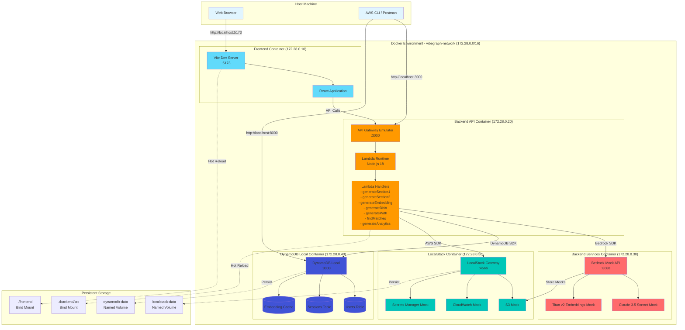
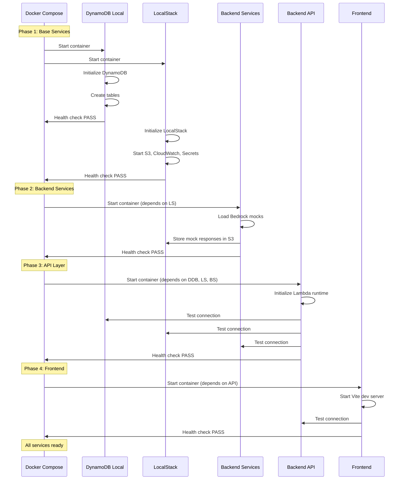
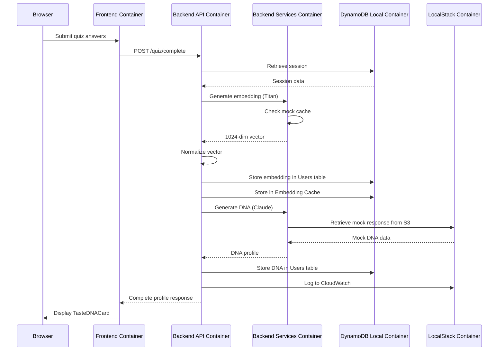
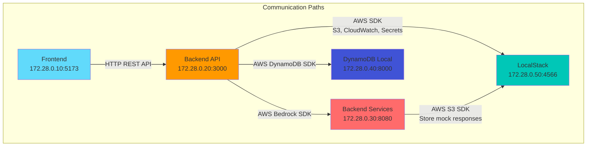
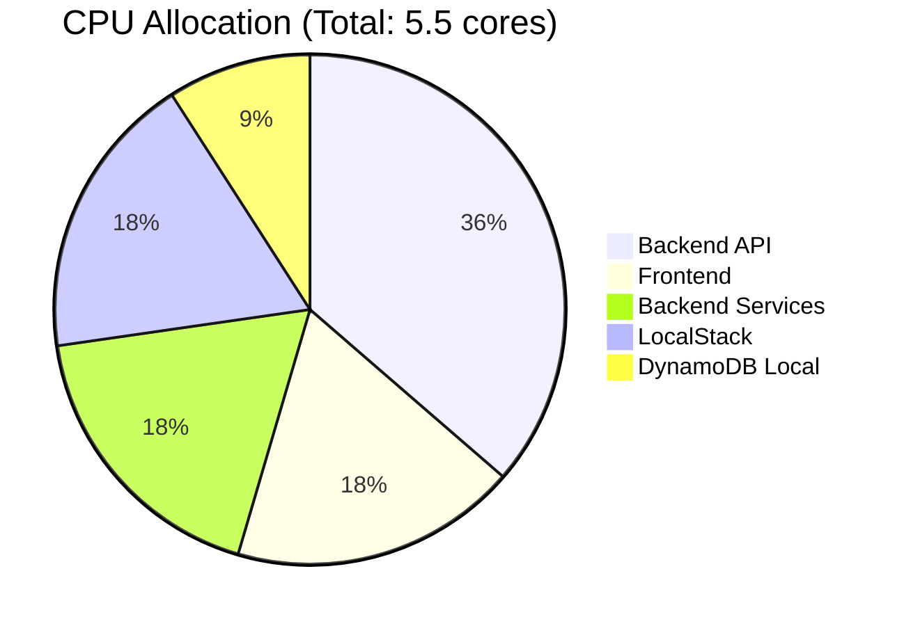
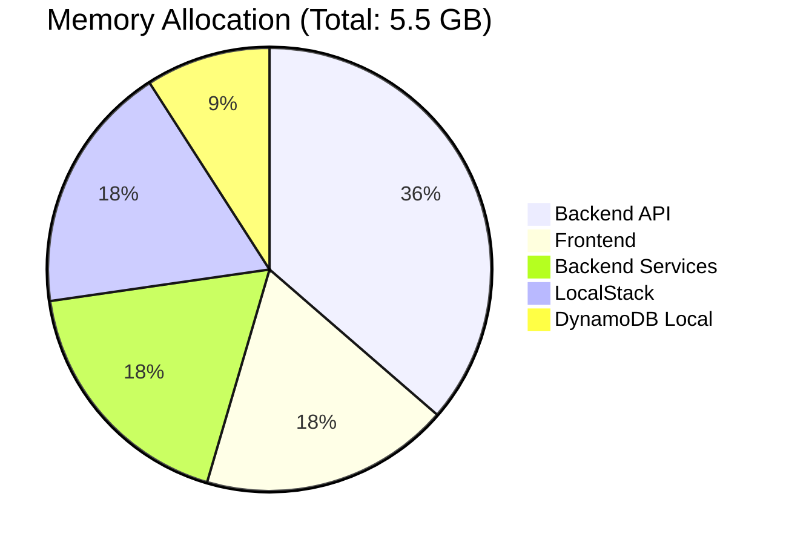
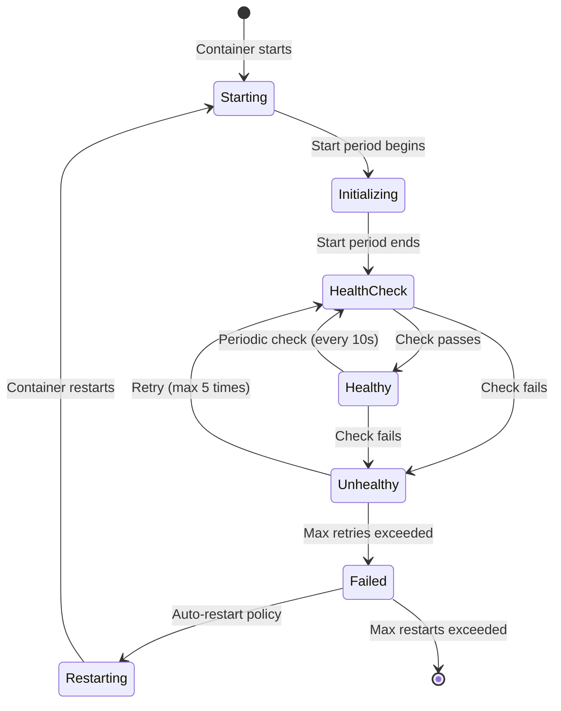
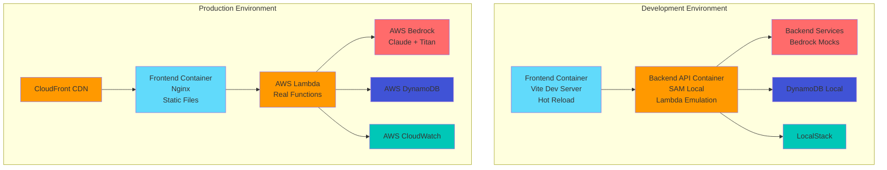
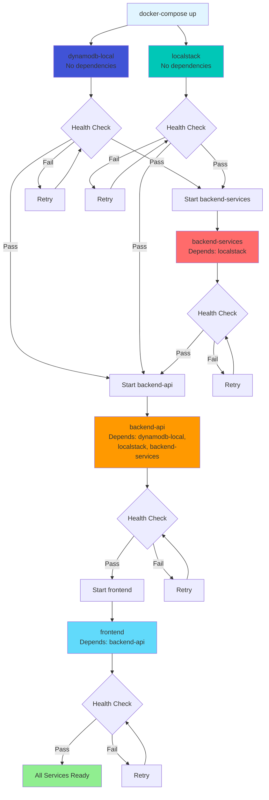
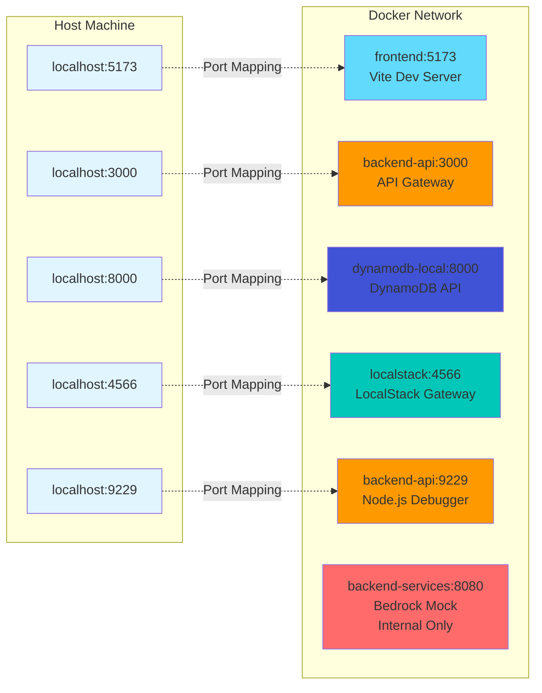

# Docker Architecture Diagrams

## System Overview Diagram



## Container Startup Sequence



## Data Flow: Quiz Completion



## Volume Mount Strategy

```mermaid
graph LR
    subgraph "Host File System"
        HOST_FE[./frontend/]
        HOST_BE[./backend/src/]
        HOST_INFRA[./backend/infrastructure/]
        HOST_MOCKS[./backend/mocks/]
    end
    
    subgraph "Frontend Container"
        CONT_FE[/app/]
        CONT_FE_NM[/app/node_modules/<br/>Anonymous Volume]
    end
    
    subgraph "Backend API Container"
        CONT_BE[/var/task/src/]
        CONT_BE_NM[/var/task/node_modules/<br/>Anonymous Volume]
        CONT_INFRA[/var/task/infrastructure/<br/>Read-Only]
    end
    
    subgraph "Backend Services Container"
        CONT_MOCKS[/app/]
    end
    
    subgraph "DynamoDB Local Container"
        CONT_DDB[/data/]
    end
    
    subgraph "LocalStack Container"
        CONT_LS[/tmp/localstack/]
    end
    
    subgraph "Docker Volumes"
        VOL_DDB[dynamodb-data]
        VOL_LS[localstack-data]
    end
    
    HOST_FE -.->|Bind Mount<br/>Read-Write| CONT_FE
    HOST_BE -.->|Bind Mount<br/>Read-Write| CONT_BE
    HOST_INFRA -.->|Bind Mount<br/>Read-Only| CONT_INFRA
    HOST_MOCKS -.->|Bind Mount<br/>Read-Write| CONT_MOCKS
    
    VOL_DDB -.->|Named Volume<br/>Persistent| CONT_DDB
    VOL_LS -.->|Named Volume<br/>Persistent| CONT_LS
    
    style HOST_FE fill:#e1f5ff
    style HOST_BE fill:#e1f5ff
    style HOST_INFRA fill:#e1f5ff
    style HOST_MOCKS fill:#e1f5ff
    style CONT_FE fill:#61dafb
    style CONT_BE fill:#ff9900
    style CONT_MOCKS fill:#ff6b6b
    style CONT_DDB fill:#4053d6
    style CONT_LS fill:#00c7b7
    style VOL_DDB fill:#ffd700
    style VOL_LS fill:#ffd700
```

## Network Communication Matrix



## Resource Allocation Visualization





## Container Health Check Flow



## Development vs Production Architecture



## Container Dependency Tree



## Port Mapping Overview



## Legend

### Container Colors
- 🔵 **Blue (#61dafb)**: Frontend (React/Vite)
- 🟠 **Orange (#ff9900)**: Backend API (Lambda/API Gateway)
- 🔴 **Red (#ff6b6b)**: Backend Services (Bedrock Mocks)
- 🟣 **Purple (#4053d6)**: Database (DynamoDB)
- 🟢 **Teal (#00c7b7)**: AWS Services (LocalStack)
- 🟡 **Yellow (#ffd700)**: Persistent Storage (Volumes)
- ⚪ **Light Blue (#e1f5ff)**: External (Host/Browser)

### Connection Types
- **Solid Arrow (→)**: Direct communication
- **Dotted Arrow (-.->)**: Volume mount or persistence
- **Dashed Line (---)**: Dependency relationship
