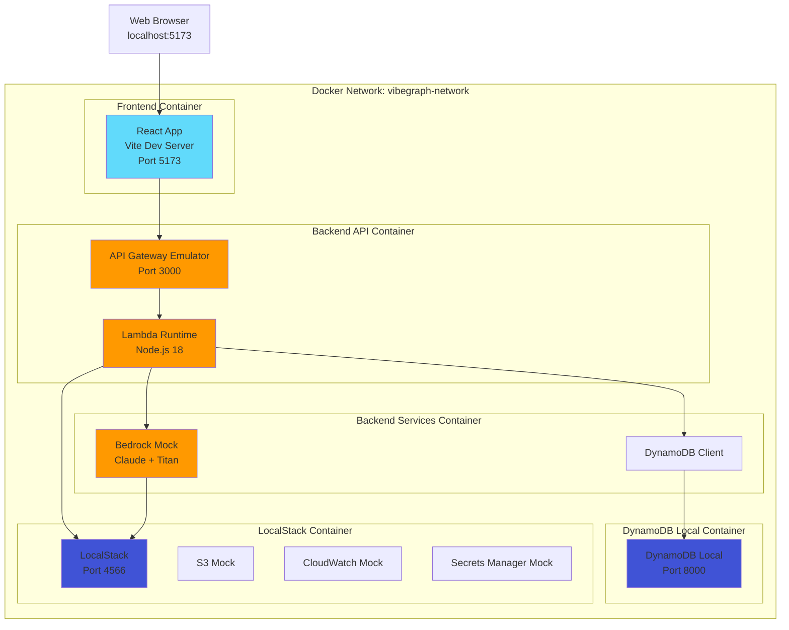
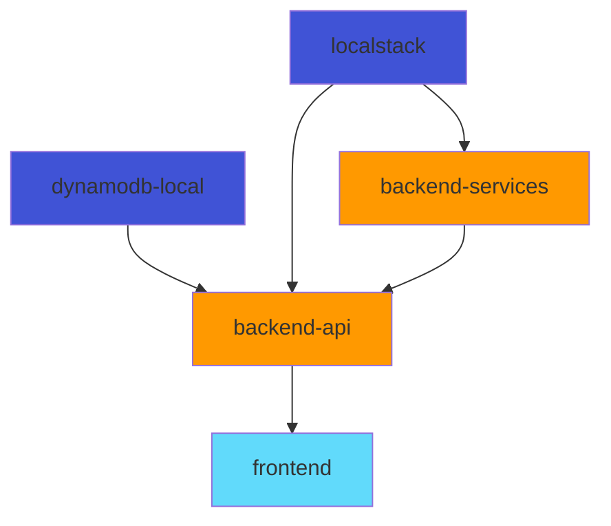

# Docker Architecture Plan: VibeGraph Backend Integration

## Overview

This document defines the Docker containerization architecture for the VibeGraph application, which integrates a React frontend with a serverless backend architecture. The containerized system enables local development and testing while maintaining production-like behavior through LocalStack for AWS service emulation.

## Container Architecture

### Container Boundaries

The system is organized into 5 primary containers:

1. **frontend** - React application with Vite dev server
2. **backend-api** - API Gateway emulation and Lambda function runtime
3. **backend-services** - AWS service emulation (Bedrock, DynamoDB)
4. **dynamodb-local** - Local DynamoDB instance for data persistence
5. **localstack** - AWS service mocking (S3, CloudWatch, Secrets Manager)

### Architecture Diagram



## Container Specifications

### 1. Frontend Container

**Purpose**: Serve React application with hot module replacement for development

**Base Image**: `node:18-alpine`

**Exposed Ports**:
- `5173` - Vite dev server (mapped to host `5173`)

**Environment Variables**:
```env
VITE_VIBEGRAPH_API_URL=http://backend-api:3000
VITE_ENV=development
NODE_ENV=development
```

**Volume Mounts**:
- Development:
  - `./frontend:/app` - Source code with hot reload
  - `/app/node_modules` - Anonymous volume for dependencies
- Production:
  - `./frontend/dist:/usr/share/nginx/html:ro` - Built static files

**Dependencies**:
- Depends on: `backend-api`
- Startup order: 3rd (after backend services are ready)

**Health Check**:
```yaml
healthcheck:
  test: ["CMD", "wget", "--quiet", "--tries=1", "--spider", "http://localhost:5173"]
  interval: 10s
  timeout: 5s
  retries: 3
  start_period: 20s
```

**Resource Limits**:
```yaml
deploy:
  resources:
    limits:
      cpus: '1.0'
      memory: 1G
    reservations:
      cpus: '0.5'
      memory: 512M
```

---

### 2. Backend API Container

**Purpose**: Run Lambda functions locally with API Gateway emulation

**Base Image**: `amazon/aws-sam-cli-emulation-image-nodejs18.x`

**Exposed Ports**:
- `3000` - API Gateway endpoints (mapped to host `3000`)
- `9229` - Node.js debugger (mapped to host `9229`)

**Environment Variables**:
```env
AWS_REGION=us-east-1
AWS_ACCESS_KEY_ID=test
AWS_SECRET_ACCESS_KEY=test
DYNAMODB_ENDPOINT=http://dynamodb-local:8000
LOCALSTACK_ENDPOINT=http://localstack:4566
BEDROCK_ENDPOINT=http://backend-services:8080
SESSIONS_TABLE=vibegraph-sessions
USERS_TABLE=vibegraph-users
CACHE_TABLE=vibegraph-embedding-cache
JWT_SECRET=dev-secret-key-change-in-production
LOG_LEVEL=debug
NODE_ENV=development
```

**Volume Mounts**:
- Development:
  - `./backend/src:/var/task/src` - Lambda function code with hot reload
  - `./backend/events:/var/task/events` - Test event payloads
  - `./backend/infrastructure/template.yaml:/var/task/template.yaml:ro` - SAM template
- Production:
  - `./backend/dist:/var/task:ro` - Compiled Lambda functions

**Dependencies**:
- Depends on: `dynamodb-local`, `localstack`, `backend-services`
- Startup order: 2nd (after data services are ready)

**Health Check**:
```yaml
healthcheck:
  test: ["CMD", "curl", "-f", "http://localhost:3000/health"]
  interval: 10s
  timeout: 5s
  retries: 5
  start_period: 30s
```

**Resource Limits**:
```yaml
deploy:
  resources:
    limits:
      cpus: '2.0'
      memory: 2G
    reservations:
      cpus: '1.0'
      memory: 1G
```

---

### 3. Backend Services Container

**Purpose**: Mock AWS Bedrock services (Claude and Titan) for local development

**Base Image**: `python:3.11-slim`

**Exposed Ports**:
- `8080` - Bedrock mock API (internal only)

**Environment Variables**:
```env
BEDROCK_REGION=us-east-1
CLAUDE_MODEL=anthropic.claude-3-5-sonnet-20241022-v2:0
TITAN_MODEL=amazon.titan-embed-text-v2:0
MOCK_MODE=true
LOG_LEVEL=info
```

**Volume Mounts**:
- Development:
  - `./backend/mocks/bedrock:/app` - Mock service implementation
  - `./backend/mocks/responses:/app/responses` - Pre-generated mock responses
- Production:
  - None (uses real AWS Bedrock in production)

**Dependencies**:
- Depends on: `localstack`
- Startup order: 1st (alongside data services)

**Health Check**:
```yaml
healthcheck:
  test: ["CMD", "curl", "-f", "http://localhost:8080/health"]
  interval: 10s
  timeout: 5s
  retries: 3
  start_period: 15s
```

**Resource Limits**:
```yaml
deploy:
  resources:
    limits:
      cpus: '1.0'
      memory: 1G
    reservations:
      cpus: '0.5'
      memory: 512M
```

---

### 4. DynamoDB Local Container

**Purpose**: Local DynamoDB instance for data persistence during development

**Base Image**: `amazon/dynamodb-local:latest`

**Exposed Ports**:
- `8000` - DynamoDB API (mapped to host `8000`)

**Environment Variables**:
```env
AWS_REGION=us-east-1
AWS_ACCESS_KEY_ID=test
AWS_SECRET_ACCESS_KEY=test
```

**Command**:
```bash
-jar DynamoDBLocal.jar -sharedDb -dbPath /data
```

**Volume Mounts**:
- Development:
  - `dynamodb-data:/data` - Persistent data storage (named volume)
  - `./backend/infrastructure/dynamodb:/docker-entrypoint-initdb.d:ro` - Table schemas
- Production:
  - None (uses AWS DynamoDB in production)

**Dependencies**:
- None (base service)
- Startup order: 1st

**Health Check**:
```yaml
healthcheck:
  test: ["CMD-SHELL", "curl -f http://localhost:8000 || exit 1"]
  interval: 10s
  timeout: 5s
  retries: 3
  start_period: 10s
```

**Resource Limits**:
```yaml
deploy:
  resources:
    limits:
      cpus: '0.5'
      memory: 512M
    reservations:
      cpus: '0.25'
      memory: 256M
```

---

### 5. LocalStack Container

**Purpose**: Mock AWS services (S3, CloudWatch, Secrets Manager) for local development

**Base Image**: `localstack/localstack:latest`

**Exposed Ports**:
- `4566` - LocalStack gateway (mapped to host `4566`)
- `4571` - S3 service (internal)

**Environment Variables**:
```env
SERVICES=s3,cloudwatch,secretsmanager,logs
DEBUG=1
DATA_DIR=/tmp/localstack/data
DOCKER_HOST=unix:///var/run/docker.sock
AWS_DEFAULT_REGION=us-east-1
EDGE_PORT=4566
```

**Volume Mounts**:
- Development:
  - `localstack-data:/tmp/localstack` - Persistent service data (named volume)
  - `/var/run/docker.sock:/var/run/docker.sock:ro` - Docker socket for container management
  - `./backend/scripts/localstack-init.sh:/docker-entrypoint-initaws.d/init.sh:ro` - Initialization script
- Production:
  - None (uses real AWS services in production)

**Dependencies**:
- None (base service)
- Startup order: 1st

**Health Check**:
```yaml
healthcheck:
  test: ["CMD", "curl", "-f", "http://localhost:4566/_localstack/health"]
  interval: 10s
  timeout: 5s
  retries: 5
  start_period: 20s
```

**Resource Limits**:
```yaml
deploy:
  resources:
    limits:
      cpus: '1.0'
      memory: 1G
    reservations:
      cpus: '0.5'
      memory: 512M
```

## Network Configuration

### Docker Network

**Network Name**: `vibegraph-network`

**Driver**: `bridge`

**Subnet**: `172.28.0.0/16`

**IP Address Allocation**:
- `172.28.0.10` - frontend
- `172.28.0.20` - backend-api
- `172.28.0.30` - backend-services
- `172.28.0.40` - dynamodb-local
- `172.28.0.50` - localstack

**DNS Configuration**:
- Enable DNS resolution between containers
- Container names resolve to their IP addresses
- Example: `backend-api` resolves to `172.28.0.20`

### Inter-Container Communication

**Frontend → Backend API**:
- Protocol: HTTP
- URL: `http://backend-api:3000`
- Endpoints: All API Gateway routes
- Authentication: JWT tokens in Authorization header

**Backend API → DynamoDB Local**:
- Protocol: HTTP (AWS SDK)
- URL: `http://dynamodb-local:8000`
- Operations: PutItem, GetItem, UpdateItem, Scan, Query

**Backend API → Backend Services (Bedrock Mock)**:
- Protocol: HTTP (AWS SDK)
- URL: `http://backend-services:8080`
- Operations: InvokeModel (Claude), InvokeModel (Titan)

**Backend API → LocalStack**:
- Protocol: HTTP (AWS SDK)
- URL: `http://localstack:4566`
- Services: S3, CloudWatch Logs, Secrets Manager

**Backend Services → LocalStack**:
- Protocol: HTTP
- URL: `http://localstack:4566`
- Purpose: Store mock response templates in S3

### External Access

**Host → Frontend**:
- Port: `5173`
- URL: `http://localhost:5173`
- Purpose: Web browser access to React app

**Host → Backend API**:
- Port: `3000`
- URL: `http://localhost:3000`
- Purpose: Direct API testing (Postman, curl)

**Host → DynamoDB Local**:
- Port: `8000`
- URL: `http://localhost:8000`
- Purpose: DynamoDB admin tools, AWS CLI

**Host → LocalStack**:
- Port: `4566`
- URL: `http://localhost:4566`
- Purpose: AWS CLI, LocalStack dashboard

## Volume Management

### Named Volumes

**dynamodb-data**:
- Purpose: Persist DynamoDB tables across container restarts
- Driver: local
- Backup: Manual export via AWS CLI
- Cleanup: `docker volume rm vibegraph_dynamodb-data`

**localstack-data**:
- Purpose: Persist LocalStack service data (S3 buckets, logs)
- Driver: local
- Backup: Manual export via AWS CLI
- Cleanup: `docker volume rm vibegraph_localstack-data`

### Bind Mounts (Development)

**Frontend Source Code**:
- Host: `./frontend`
- Container: `/app`
- Purpose: Hot module replacement for React development
- Read/Write: Read-write

**Backend Lambda Functions**:
- Host: `./backend/src`
- Container: `/var/task/src`
- Purpose: Live reload Lambda functions on code changes
- Read/Write: Read-write

**Backend Infrastructure**:
- Host: `./backend/infrastructure`
- Container: `/var/task/infrastructure`
- Purpose: SAM templates and DynamoDB schemas
- Read/Write: Read-only

**Bedrock Mock Service**:
- Host: `./backend/mocks/bedrock`
- Container: `/app`
- Purpose: Develop and test Bedrock mock responses
- Read/Write: Read-write

### Anonymous Volumes

**Frontend node_modules**:
- Container: `/app/node_modules`
- Purpose: Prevent host node_modules from overriding container dependencies
- Lifecycle: Removed when container is removed

**Backend node_modules**:
- Container: `/var/task/node_modules`
- Purpose: Isolate Lambda function dependencies
- Lifecycle: Removed when container is removed

## Container Dependencies and Startup Order

### Startup Sequence

**Phase 1: Base Services** (parallel startup)
1. `dynamodb-local` - No dependencies
2. `localstack` - No dependencies

**Phase 2: Backend Services** (after Phase 1 health checks pass)
3. `backend-services` - Depends on `localstack`

**Phase 3: API Layer** (after Phase 2 health checks pass)
4. `backend-api` - Depends on `dynamodb-local`, `localstack`, `backend-services`

**Phase 4: Frontend** (after Phase 3 health checks pass)
5. `frontend` - Depends on `backend-api`

### Dependency Graph



### Health Check Strategy

**Wait Conditions**:
- Each container waits for its dependencies to pass health checks
- Health checks run every 10 seconds
- Containers retry failed health checks up to 5 times
- Start period allows time for initialization before health checks begin

**Failure Handling**:
- If a dependency fails health checks, dependent containers do not start
- Failed containers automatically restart (restart policy: `unless-stopped`)
- Maximum restart attempts: 3 within 5 minutes
- After max restarts, container enters failed state and requires manual intervention

## Development vs Production Configuration

### Development Mode

**Characteristics**:
- All containers run locally
- Hot module replacement enabled
- Debug ports exposed (9229 for Node.js)
- Verbose logging (LOG_LEVEL=debug)
- Mock AWS services (LocalStack, Bedrock mock)
- Persistent volumes for data retention
- Source code bind mounts for live reload

**Environment File**: `.env.development`

**Docker Compose File**: `docker-compose.dev.yml`

**Startup Command**:
```bash
docker-compose -f docker-compose.dev.yml up --build
```

### Production Mode

**Characteristics**:
- Frontend: Nginx serving static build
- Backend: AWS Lambda (not containerized)
- Database: AWS DynamoDB (not containerized)
- Services: AWS Bedrock (not containerized)
- No LocalStack or mocks
- Minimal logging (LOG_LEVEL=info)
- No debug ports exposed
- Read-only volume mounts
- Multi-stage Docker builds for optimization

**Environment File**: `.env.production`

**Docker Compose File**: `docker-compose.prod.yml`

**Frontend Production Container**:
```dockerfile
FROM node:18-alpine AS builder
WORKDIR /app
COPY package*.json ./
RUN npm ci --only=production
COPY . .
RUN npm run build

FROM nginx:alpine
COPY --from=builder /app/dist /usr/share/nginx/html
COPY nginx.conf /etc/nginx/nginx.conf
EXPOSE 80
CMD ["nginx", "-g", "daemon off;"]
```

**Deployment Strategy**:
- Frontend: Deploy container to AWS ECS/Fargate or CloudFront + S3
- Backend: Deploy Lambda functions via AWS SAM
- No backend containers in production (serverless architecture)

## Container Initialization

### DynamoDB Local Initialization

**Script**: `backend/scripts/init-dynamodb.sh`

**Purpose**: Create tables on first startup

**Tables Created**:
1. `vibegraph-users` - User profiles, embeddings, DNA, paths
2. `vibegraph-sessions` - Quiz sessions with 1-hour TTL
3. `vibegraph-embedding-cache` - Cached Titan embeddings

**Execution**:
- Runs automatically when DynamoDB container starts
- Checks if tables exist before creating
- Loads table schemas from `backend/infrastructure/dynamodb/*.json`

**Example**:
```bash
#!/bin/bash
aws dynamodb create-table \
  --endpoint-url http://localhost:8000 \
  --cli-input-json file:///docker-entrypoint-initdb.d/usersTable.json \
  --region us-east-1
```

### LocalStack Initialization

**Script**: `backend/scripts/localstack-init.sh`

**Purpose**: Set up S3 buckets, secrets, and CloudWatch log groups

**Resources Created**:
1. S3 bucket: `vibegraph-mock-responses` - Bedrock mock response templates
2. Secret: `vibegraph/jwt-secret` - JWT signing key
3. Log group: `/aws/lambda/vibegraph` - Lambda function logs

**Execution**:
- Runs automatically via `/docker-entrypoint-initaws.d/init.sh`
- Waits for LocalStack to be fully ready
- Idempotent (safe to run multiple times)

**Example**:
```bash
#!/bin/bash
awslocal s3 mb s3://vibegraph-mock-responses
awslocal secretsmanager create-secret \
  --name vibegraph/jwt-secret \
  --secret-string "dev-secret-key"
awslocal logs create-log-group \
  --log-group-name /aws/lambda/vibegraph
```

### Backend Services Initialization

**Script**: `backend/mocks/bedrock/init.py`

**Purpose**: Load mock Claude and Titan responses

**Mock Data**:
1. Claude responses: Pre-generated quiz questions, DNA profiles, paths
2. Titan embeddings: Pre-computed 1024-dimensional vectors for common inputs

**Execution**:
- Runs when backend-services container starts
- Loads mock data from `backend/mocks/responses/*.json`
- Registers mock endpoints for Bedrock API

## Resource Allocation

### Total System Requirements

**Development Environment**:
- CPU: 6 cores (recommended 8 cores)
- Memory: 6 GB RAM (recommended 8 GB)
- Disk: 10 GB free space
- Network: 100 Mbps

**Production Environment** (frontend container only):
- CPU: 1 core
- Memory: 512 MB RAM
- Disk: 500 MB
- Network: 1 Gbps

### Per-Container Allocation

| Container | CPU Limit | CPU Reserve | Memory Limit | Memory Reserve |
|-----------|-----------|-------------|--------------|----------------|
| frontend | 1.0 | 0.5 | 1 GB | 512 MB |
| backend-api | 2.0 | 1.0 | 2 GB | 1 GB |
| backend-services | 1.0 | 0.5 | 1 GB | 512 MB |
| dynamodb-local | 0.5 | 0.25 | 512 MB | 256 MB |
| localstack | 1.0 | 0.5 | 1 GB | 512 MB |
| **Total** | **5.5** | **2.75** | **5.5 GB** | **2.78 GB** |

### Scaling Considerations

**Horizontal Scaling** (multiple instances):
- Frontend: Scale to N instances behind load balancer
- Backend API: Not applicable (Lambda scales automatically in production)
- DynamoDB Local: Not scalable (single instance only)

**Vertical Scaling** (increase resources):
- Increase memory for backend-api if Lambda functions are memory-intensive
- Increase CPU for backend-services if mock response generation is slow
- Increase DynamoDB Local memory if working with large datasets

## Security Considerations

### Container Isolation

**Network Isolation**:
- Containers communicate only via defined network
- No direct host network access
- Internal services (backend-services, dynamodb-local) not exposed to host

**User Permissions**:
- Containers run as non-root user where possible
- Read-only file systems for production containers
- Minimal base images (Alpine Linux)

**Secrets Management**:
- Environment variables for non-sensitive config
- LocalStack Secrets Manager for sensitive data in development
- AWS Secrets Manager for production
- Never commit secrets to version control

### Development Security

**JWT Secret**:
- Development: Hardcoded in `.env.development`
- Production: Retrieved from AWS Secrets Manager
- Rotation: Every 90 days in production

**AWS Credentials**:
- Development: Fake credentials (`test`/`test`)
- Production: IAM roles for Lambda execution
- No hardcoded credentials in code

**CORS Configuration**:
- Development: Allow `http://localhost:5173`
- Production: Allow only production domain
- No wildcard (`*`) in production

## Monitoring and Logging

### Log Aggregation

**Development**:
- All container logs output to stdout/stderr
- View with: `docker-compose logs -f [service]`
- Logs stored in Docker's JSON file driver

**Production**:
- Frontend: Nginx access logs to CloudWatch
- Backend: Lambda logs to CloudWatch Logs
- DynamoDB: CloudWatch metrics and logs
- Centralized logging via CloudWatch Insights

### Health Monitoring

**Container Health**:
- Health checks every 10 seconds
- Unhealthy containers automatically restart
- Alert on 3 consecutive failures

**Application Health**:
- `/health` endpoint on backend-api
- Returns 200 OK with service status
- Checks DynamoDB and LocalStack connectivity

**Metrics**:
- Container CPU and memory usage via Docker stats
- API response times via CloudWatch metrics
- DynamoDB read/write capacity via CloudWatch

## Backup and Recovery

### Data Backup

**DynamoDB Local**:
- Manual backup: `aws dynamodb scan --table-name vibegraph-users --endpoint-url http://localhost:8000 > backup.json`
- Automated backup: Cron job to export tables daily
- Restore: Import JSON via AWS CLI

**LocalStack Data**:
- S3 buckets: Export via `awslocal s3 sync`
- Secrets: Export via `awslocal secretsmanager get-secret-value`
- Restore: Re-run initialization scripts

### Disaster Recovery

**Container Failure**:
- Automatic restart via Docker restart policy
- Health checks detect failures within 30 seconds
- Maximum downtime: 1 minute

**Data Corruption**:
- Restore from latest backup
- Re-initialize tables from schemas
- Replay event logs if available

**Complete System Failure**:
- Rebuild containers: `docker-compose up --build --force-recreate`
- Restore data from backups
- Verify health checks pass
- Total recovery time: 5-10 minutes

## Performance Optimization

### Container Build Optimization

**Multi-Stage Builds**:
- Separate build and runtime stages
- Minimize final image size
- Example: Frontend builder stage + Nginx runtime stage

**Layer Caching**:
- Order Dockerfile commands from least to most frequently changed
- Copy `package.json` before source code
- Leverage Docker build cache

**Image Size Reduction**:
- Use Alpine Linux base images
- Remove dev dependencies in production
- Combine RUN commands to reduce layers

### Runtime Optimization

**Lambda Cold Start Reduction**:
- Keep Lambda functions warm via scheduled pings
- Minimize Lambda package size
- Use Lambda layers for shared dependencies

**DynamoDB Performance**:
- Use partition keys for direct lookups
- Implement pagination for large scans
- Enable DynamoDB Streams for real-time updates

**Network Latency**:
- Use Docker's internal DNS for service discovery
- Keep containers on same Docker network
- Minimize data transfer between containers

## Troubleshooting Guide

### Common Issues

**Issue 1: Frontend cannot connect to backend-api**
- Symptom: CORS errors, network timeouts
- Cause: Backend API not ready or wrong URL
- Solution: Check `VITE_VIBEGRAPH_API_URL` environment variable, verify backend-api health check

**Issue 2: DynamoDB table not found**
- Symptom: Lambda functions fail with "ResourceNotFoundException"
- Cause: DynamoDB initialization script didn't run
- Solution: Restart dynamodb-local container, manually run `init-dynamodb.sh`

**Issue 3: Bedrock mock returns 404**
- Symptom: Lambda functions fail with "Model not found"
- Cause: Backend services container not initialized
- Solution: Check backend-services logs, verify mock data loaded

**Issue 4: Container fails health check**
- Symptom: Container repeatedly restarts
- Cause: Service not starting correctly, port conflict
- Solution: Check container logs, verify no port conflicts on host

**Issue 5: Out of memory errors**
- Symptom: Containers killed by OOM killer
- Cause: Insufficient memory allocation
- Solution: Increase Docker memory limit, reduce container memory limits

### Debug Commands

**View container logs**:
```bash
docker-compose logs -f backend-api
```

**Execute command in container**:
```bash
docker-compose exec backend-api sh
```

**Check container health**:
```bash
docker-compose ps
```

**Inspect network**:
```bash
docker network inspect vibegraph-network
```

**View resource usage**:
```bash
docker stats
```

## Next Steps

This architecture plan provides the foundation for implementing the Docker containerization. The next tasks will involve:

1. **Task 2**: Create Dockerfiles for each container
2. **Task 3**: Write docker-compose.yml for development environment
3. **Task 4**: Implement initialization scripts for DynamoDB and LocalStack
4. **Task 5**: Create Bedrock mock service
5. **Task 6**: Configure networking and environment variables
6. **Task 7**: Write docker-compose.prod.yml for production
7. **Task 8**: Document setup and usage instructions

## References

- [Docker Compose Documentation](https://docs.docker.com/compose/)
- [AWS SAM Local Documentation](https://docs.aws.amazon.com/serverless-application-model/latest/developerguide/sam-cli-command-reference-sam-local-start-api.html)
- [LocalStack Documentation](https://docs.localstack.cloud/)
- [DynamoDB Local Documentation](https://docs.aws.amazon.com/amazondynamodb/latest/developerguide/DynamoDBLocal.html)
- [VibeGraph Requirements Document](../../docs/architecture/requirements.md)
- [VibeGraph Design Document](../../docs/architecture/design.md)
